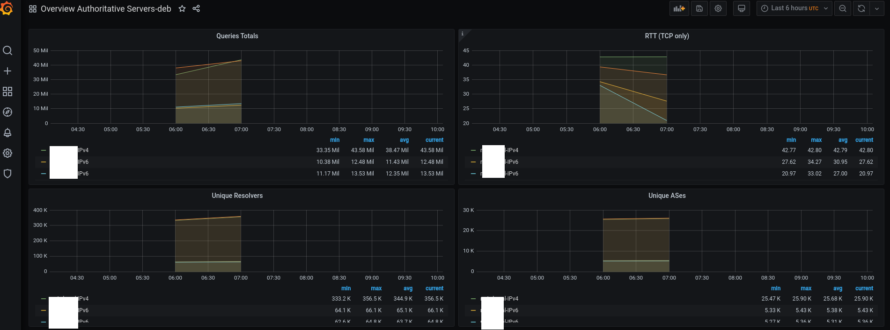
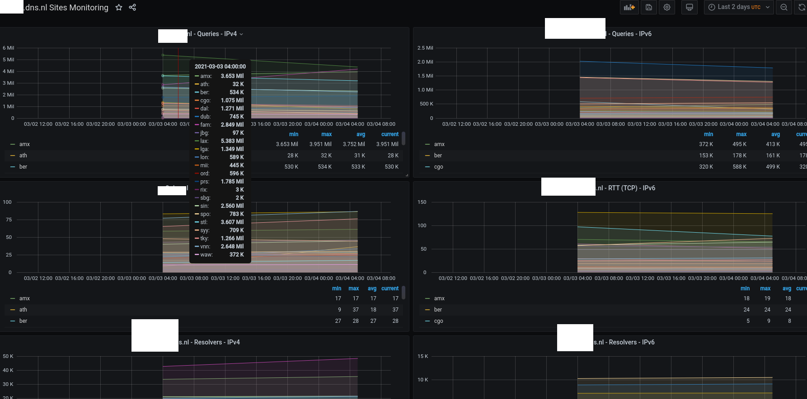

# Anteater Dashboards

## 1. Overview authoritative server dashboard
 * The `stats_per_server.py` script populates the database, which can be used
to generate dashdoards as below:

## 2. Dashboard per authoritative server (sites)

 * The `stats_per_site.py` script populates the database, which can be used
to generate dashdoards as below.
 * **Note**: this script generates **1 dashboard** per authoritative server  
   

 
## 3. Hypergiants and favorite ASes

* TODO

